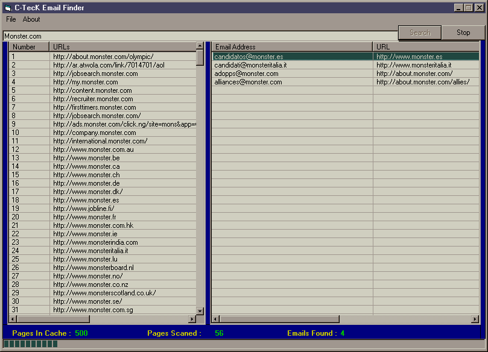



## \[ Email Spider \] \(UPDATED by Gregg Housh

### Description

This code first finds a number a links that you specify, and then goes to the links looking for email addresses. it does not look for the mailto: it looks for the @. So by doing this I get some

email addresses that are not email addresses, but that does not happen to much. But, I need your help. This program Seems to freeze up, but it does not, you can move the window and

press buttons, but the spider will spot search for links or email address for about 15 sec and then continues again. But, over all, it works good. beside I just made it in 12 hours. I would

like you to look at the code and try to make it go faster. There are no bugs that I know of. But I like to hear what you got to say about this prog and what I need to do, so I can improve

it. By the way, sorry about the poor coding. I'm not the best at VB. I can only code with what I know, and work from that. Thanks. Also please visit my site at ComputerTecK.com

Have fun!!
 
### More Info
 

             |
---                |---
**Submitted On**   |2002-05-19 13:24:40
**By**             |[Brian Link](https://github.com/Planet-Source-Code/PSCIndex/blob/master/ByAuthor/brian-link.md)
**Level**          |Intermediate
**User Rating**    |4.0 (32 globes from 8 users)
**Compatibility**  |VB 6\.0
**Category**       |[Internet/ HTML](https://github.com/Planet-Source-Code/PSCIndex/blob/master/ByCategory/internet-html__1-34.md)
**World**          |[Visual Basic](https://github.com/Planet-Source-Code/PSCIndex/blob/master/ByWorld/visual-basic.md)
**Archive File**   |[\[\_Email\_Sp849295192002\.zip](https://github.com/Planet-Source-Code/brian-link-email-spider-updated-by-gregg-housh__1-34925/archive/master.zip)

